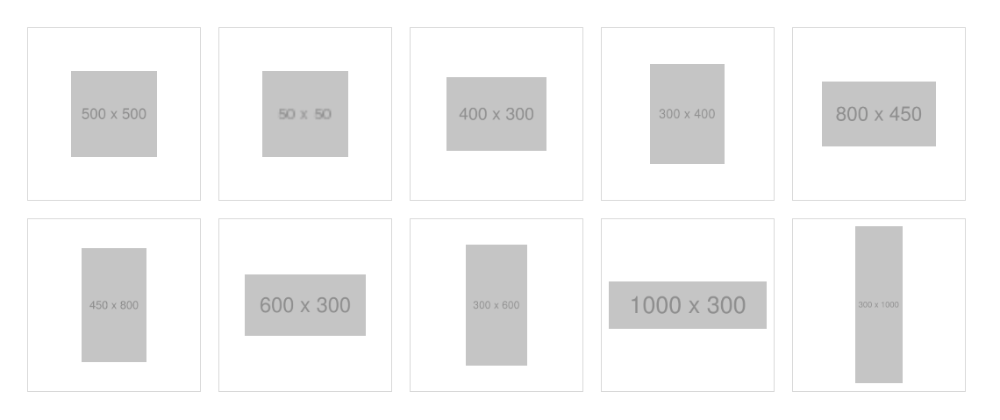

# adjust-images.js

画像の面積をだいたい揃えるjsです。ギャラリーやロゴ一覧などに。  

[Example🔗](https://sk-rt.github.io/adjust-images/)





- 画像の縦横比率から割り出したwidth(or height）を`%`で追加。
- `` の親要素に width/heightを指定する必要があります。
- 縦横比1:1の画像はデフォルトで `width:50%` になります。


## Usage
```js
/**
 * @param {NodeListOf<HTMLImageElement>} images - 対象のimgのリスト
 * @param {number?} reference - 基準値。画像の比率が1:1の時の比率（0.5ならwidth:50%）(Optional)
 */
adjustImages( document.querySelectorAll(".image-item img"), 0.5 );
```

## Sample

```html
<!DOCTYPE html>
<html lang="en">
<head>
    <style>
        .image-item {
            width: 15vw; 
            height: 15vw;
            border: 1px solid #DDD;
            display: flex;
            flex-flow: row nowrap;
            justify-content: center;
            align-items:center;
            margin: 10px;
        }
    </style>
    <script src="path/to/adjust-images.js"></script>
    <script>
        document.addEventListener(
            "DOMContentLoaded",
            () => {
                const images = document.querySelectorAll(".image-item img");
                adjustImages(images);
            },
            false
        );
    </script>
</head>
<body>
    <div class="image-container">
        <div class="image-item">
            
        </div>
        <div class="image-item">
            
        </div>
        <div class="image-item">
            
        </div>
        <div class="image-item">
            
        </div>
    </div>
</body>
</html>
```


